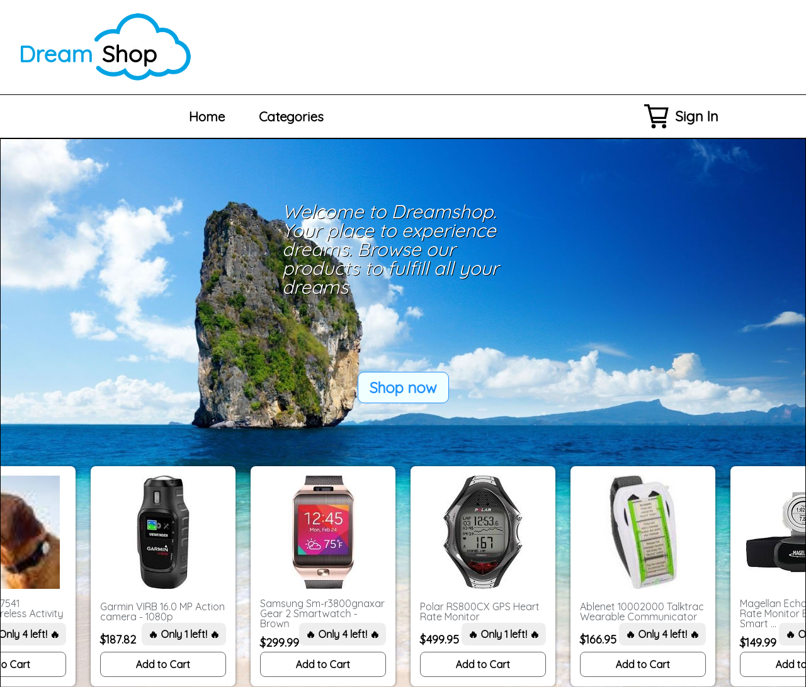
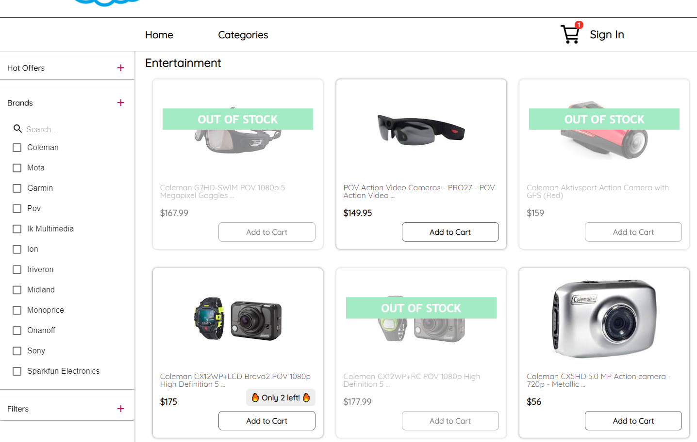
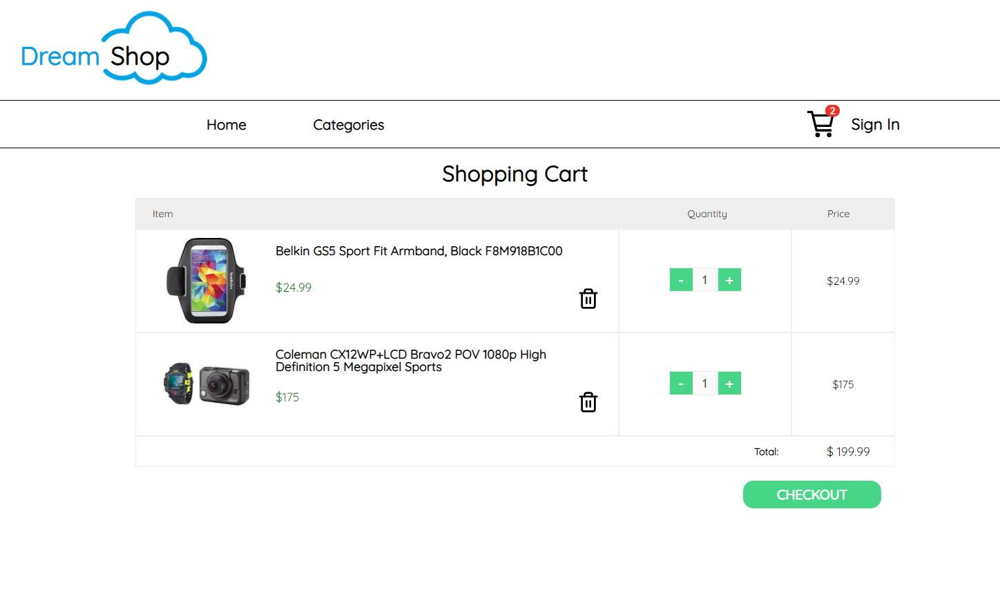
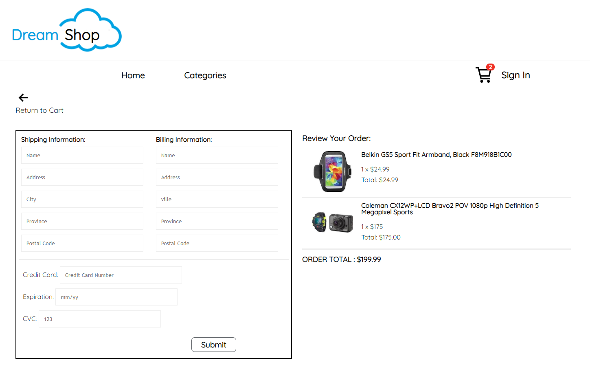
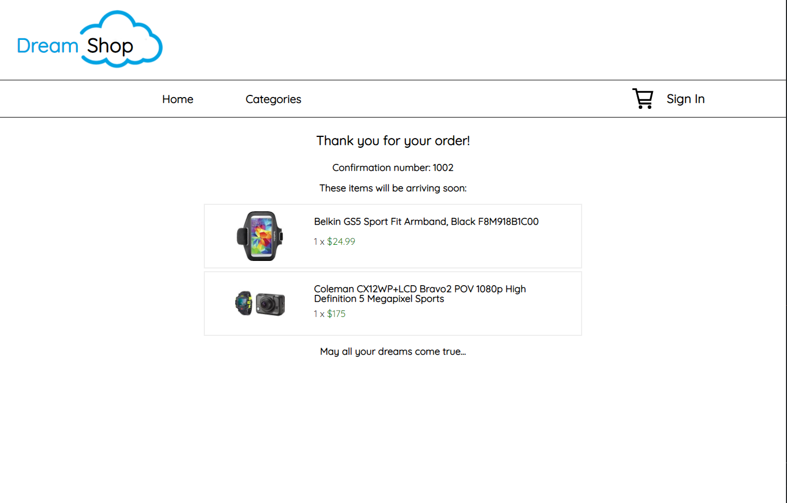
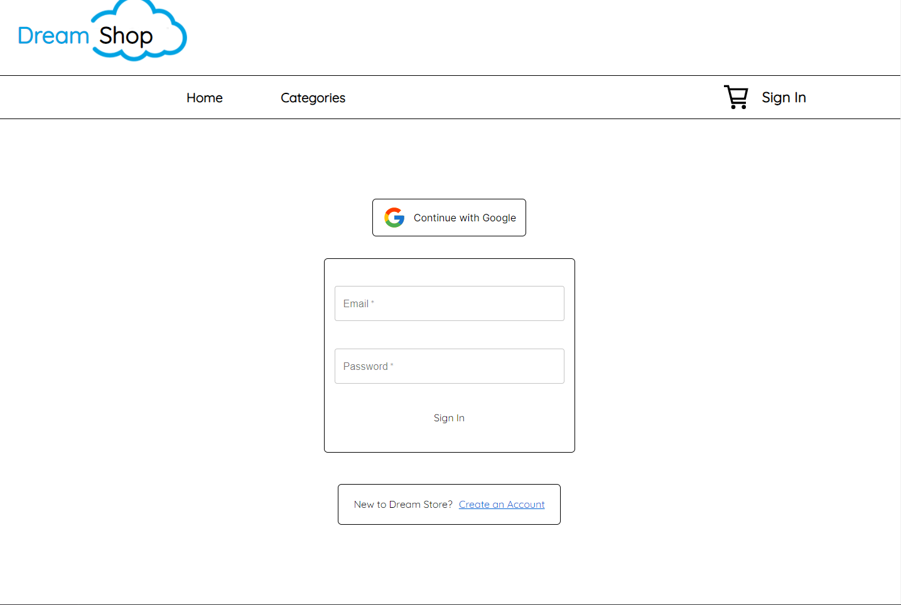
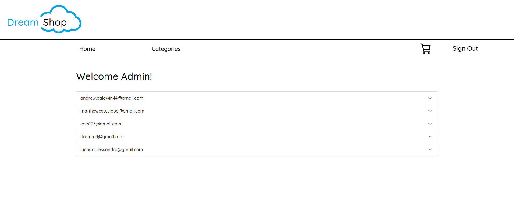
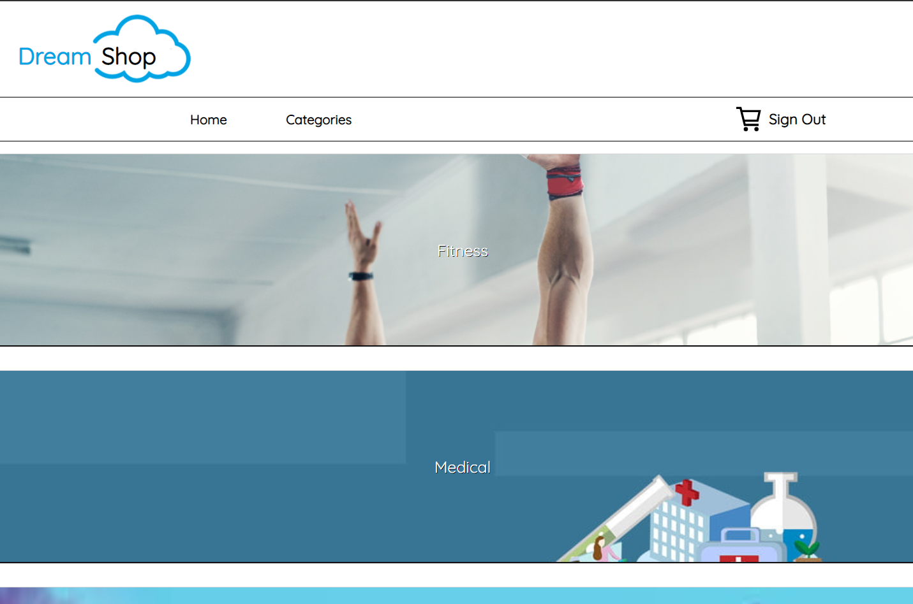

# The Dream Shop

> Group E-Commerce Project for Concordia University



## Demo

[View the Live Demo](https://the-dream-store.herokuapp.com/)

### Deploy the project

**Clone the repo to your local machine using the terminal**:

```
$ git clone git@github.com:andrewbaldwin44/project-m5-e-commerce.git
```

**Install the Dependencies**:

1. Navigate into the server directory `cd server`
2. Install the required server packages `yarn install`
3. Navigate into the client directory `cd client`
4. Install the required client packages `yarn install`
5. Start the development server `yarn start`

This will run the app in the development mode.<br />
Open [http://localhost:3000](http://localhost:3000) to view it in the browser.

The page will reload if you make edits.

**The Server**

A folder is provided, `/server`, with the backend code. This is a local server that you will connect to to retrieve/write the data. An API is provided, and documented in `server/API_DOCS.md`. You can read this document thoroughly to build an understanding of what the different endpoints are, and how they work.

### Technologies Used

**Frontend**:

- React
- Redux

**Backend**:

- Nodejs
- Express

### Authors

👤 **Andrew Baldwin**
👤 **Lucas D'Alessandro**
👤 **Matthew Cote**
👤 **Stephanos Criticos**

- Github: [@andrewbaldwin44](https://github.com/andrewbaldwin44)
- Github: [@lucasd514](https://github.com/lucasd514)
- Github: [@Matcote](https://github.com/Matcote)
- Github: [@criticos123](https://github.com/criticos123)

**Features**:

> A Category page showing all items within a certain category. A sidebar is included to filter through a number of options.



> Cart page with a link to checkout. All quantities can be modified here.



> Checkout page to accept user info.



> Confirmation page showing the user's order.



> Sign-in page using Firebase.



> Admin page using firebase to track all customer accounts and their orders.



> Navigation page linking to various category pages.


